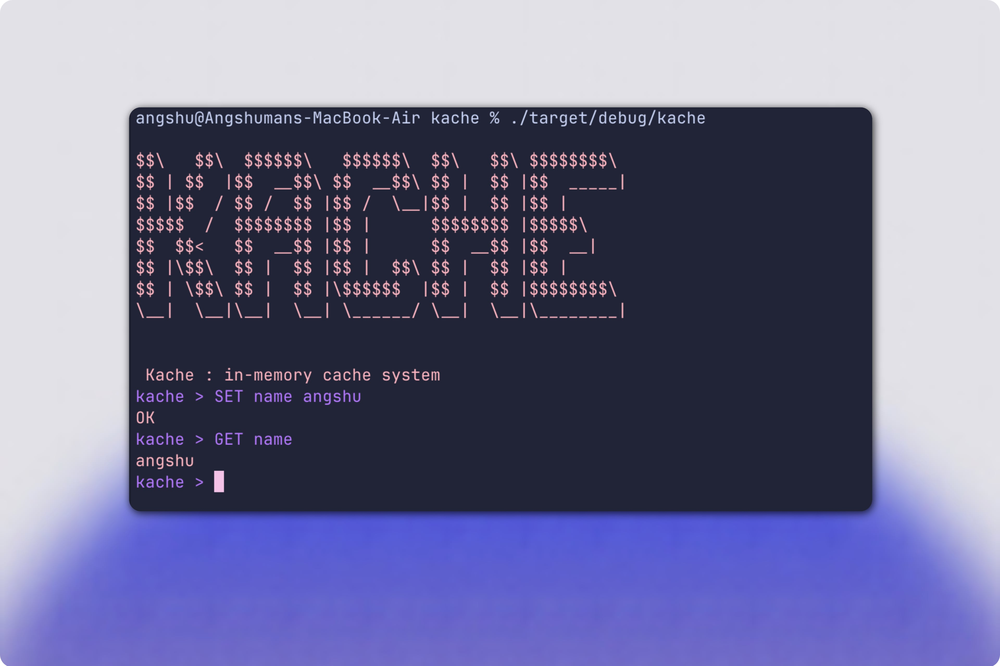

# Kache
---

Kache is a simple in-memory cache system built to understand how real-world caching systems work internally. This project is a minimal implementation of a key-value store that supports basic cache operations. The goal is to explore core system design concepts like data storage, expiration, and eviction strategies.

## How It Works

- Data is stored in memory using a key-value structure.
- Each entry can optionally have an expiration time.
- Expired entries are removed using a cleanup mechanism.
- Commands are handled through a simple REPL interface.

## Goals

- Understand how caching systems like Redis work internally
- Learn about memory management and performance trade-offs
- Implement core system design concepts from scratch

## Future Improvements

- LRU eviction policy
- Persistence (save/load data)
- Networking support (client-server model)
- Performance optimizations

## Notes

This is a learning project and not intended for production use.
